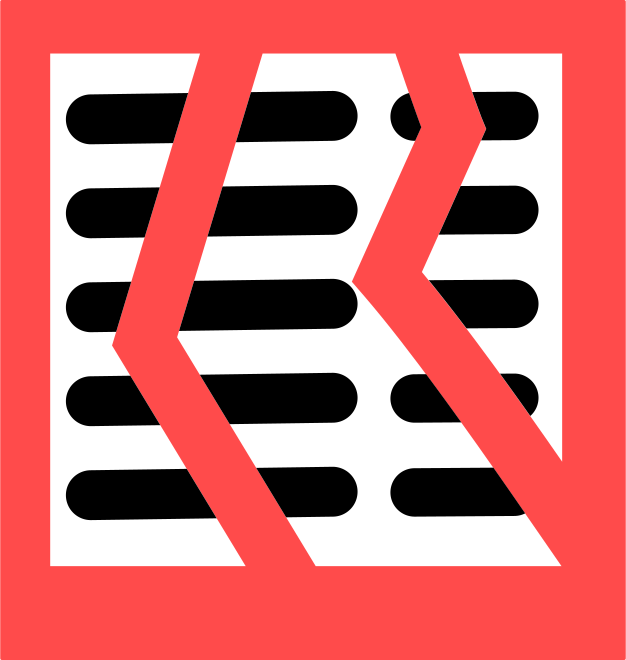

# DivisiBill

DivisiBill is simple in concept; it has two lists, Participants and Items. Each Item represents something purchased so it has
a description and a cost which is divided (perhaps unevenly) between one or more Participants.
The program does the rest, calculating tax and tip and dividing them fairly among the participants. For hints on getting started, see [Getting Started](gettingstarted.html).

The Basic Edition of the program is free, does everything locally and Items must be entered manually.
A Professional Edition subscription is available which adds cloud storage (see [licensing](licensing.html)).
In addition, you can purchase the ability to scan a bill and enter the Items automatically, or you can continue to enter Items manually. Scanned Items can be edited manually after scanning.  

Once a list of Items has been entered, you add a list of Participants for this bill and indicate the share of each item for each participant. Bills are saved so you can view old ones and/or use them as a basis for new ones (Divisibill can use GPS to load up the newest bill for wherever you happen to be).

## Pages

There are over a dozen different pages in DivisiBill, but the most important are Items and Totals. Items shows the list of purchased items for this bill, and Totals shows the total amount of the bill allocated to each of up to 10 participants.

Other pages include a list of all the people you've defined that you might use as participants on a bill (along with optional e-mail addresses), a list of venues you've entered, with optional notes and locations, the properties of the current
bill, and information about program settings, licensing, and how to use the app. You can switch between pages using the hamburger icon (<u>&#xF035C;</u>) at 
the top left corner of each of the main pages to open the [flyout menu](flyout.html), then tap to select a 
page. The main pages are:

- [Items](lineitemspage.html) and [Totals](totalspage.html)
- [Bill Image](imagepage.html) or [Camera](camerapage.html)
- [Bill Properties](propertiespage.html)
- [List of saved bills](meallistpage.html) sorted by age, name, or distance
- [Manage Data](datamanagementpage.html)
- [List of venues](venuelistviewpage.html) sorted by name or distance
- [List of People](peoplelistpage.html) sorted by name
- [Basic Program Settings](settingspagebasic.html) including [licensing](licensing.html)
- [Professional Program Settings](settingspage.html) including [licensing](licensing.html)
- [Information and Problems](aboutpage.html)

In addition there are a few other subsidiary pages reached from within these main pages such as the  [Venue Edit Page](venueeditpage.html) where you see or change venue details or the [Map Page](mappage.html) which allows you to see or change the location of a venue on a map.

## Dark Mode

Although most of the page illustrations in this help show the pages rendered in a light theme (dark text on a light background) it is also possible to use a dark theme. The application defaults to whatever the system uses, but you can change the value for the current run from the Settings page.

## Icons

DivisiBill uses a variety of icons to enable actions and show state on various pages. For a list of these, see [icons](icons.html).

## Privacy Policy

DivisiBill will not share your personal information at any time.

DivisiBill will connect to the Internet anonymously for a variety of purposes:

- to check licensing
- to post analytics

Otherwise it connects only when you specifically request it to (for example, in order to back up and recover files or send mail). If a crash should occur, the next run of DivisiBill will ask you if you wish to report it. All these activities are anonymous, though lists of people and venue names could give away information about you.

## Data Deletion Policy

Professional Edition Subscribers may delete their cloud based data (bills and/or lists of people or venues) at any time through DivisiBill, by canceling their subscription, or by sending an email request to [DivisiBill Support](mailto:support@autopl.us) along with their Professional Subscription order number (DivisiBill will add this to the mail automatically, just don't delete it). Once a Professional Subscription ends (either by being canceled or not being renewed) the corresponding cloud based data will be removed. The source of this data is anonymous though the data itself may give some clues, especially to the users location.

Last updated February 2025 for version 6.2.17
