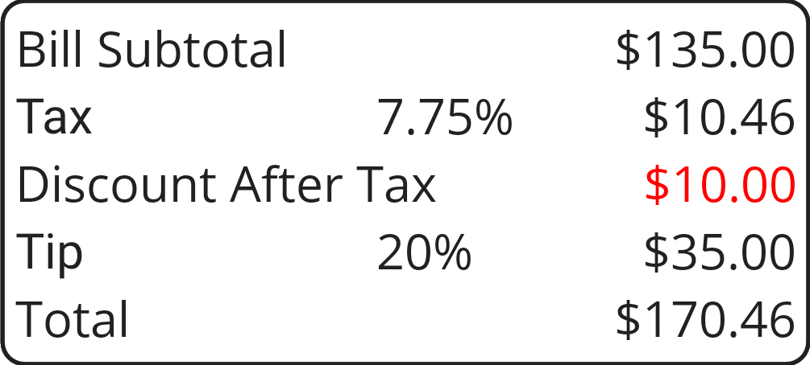

# Totals Glossary

This is a list of the important areas on the Totals page as seen from left to right, top to bottom. You can see an image of the page itself [here](totalspage.html). If you reached this page by tapping one of the active areas in the page image, the relevant heading should be highlighted below.

## Icons

These appear in the tool bar at the top of the page or in the area revealed when you swipe on a participant line. 

### Flyout (<u>&#xF035C;</u>)

This icon, in the top left corner of the screen, allows you to show or collapse the flyout menu to navigate to other pages (navigate from the Items page to the Totals page by swiping left, back by swiping right).

### Mail (<u>&#xF01F0;</u>)

Sends mail containing information about the bill overall either to the selected participant, or if none is selected, not personalized to any specific participant.

### Filter (<u>&#xF0233;</u>/<u>&#xF14F0;</u>)

Cancels filtering for a particular person if it is in use or enables filtering for the selected person of it is not.

### Add (<u>&#xF0419;</u>)

Takes you to the list of possible participants so you can select one to add.

### Delete (<u>&#xF0A7A;</u>)

Deletes the selected bill participant or, if none is selected, all bill participants (you can undo this if you do it by mistake). To delete a single participant you can also swipe left on that participant.

### Ellipsis (<u>&#xF01D9;</u>)

Tap on the ellipsis to open a secondary menu containing additional commands:

* Mail - Prepares a mail message containing information about the current bill for you to approve and send. The message is either specific to a particular participant or general depending on whether a participant is specified. 
* Replace - Opens the people list so you can select a person to replace the selected participant. 
* Payments - This duplicates the effect of a double tap and shows the breakdown of payments to reach a round number.
* Person - Allows you to view or edit the information associated with a particular participant. 

## Venue Name

This is the name of the current venue. Tap on it to see the details of the current bill, double tap to select a new venue from your list.

## Participant

Each of the participant lines shows the name of the participant and the amount allocated to them. Tap on the line to see the payment breakdown for that participant (good for answering  "what did I pay for" questions); double tap to view the detailed information for that person. Swipe the line left to delete the participant (<u>&#xF0A7A;</u>). Swipe the line right to filter items for just that participant (<u>&#xF0233;</u>).

Swiping right or tapping in the open area below the list of participants switches to the Items page, deselects any selected participant, or (with a double Tap) shows the breakdown of payments to reach a round number.   

## Unallocated Amount

If there are items not yet allocated, the total value of those items is shown here. Tap on it to switch focus to the first unallocated item.

## Rounded Total

The amount calculated if you round all the individual totals and add the rounded amounts together. Tap on this to see the overall cost breakdown for the whole bill.

## Summary

The overall summary of the bill showing the subtotal, tax, tip, and grand total. Tap anywhere in this area to switch to the Bill Properties page to see and change the values being used (such as tax and tip percentages, for example). Occasionally you'll see the word "custom" next to a tax or tip percentage on the Totals page; that is just an alert that what you have set in this Bill Properties differs from the defaults you specified in Program Settings and is normal if you're in a place with a different tax rate or are choosing to tip more or less than usual.

If "Discount After Tax" is set for this bill in the bill properties then any discount is not part of the subtotal and is shown on a separate line like this:

</object>
  